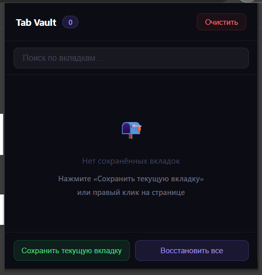
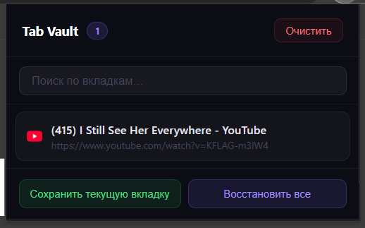

# Tab Vault 🗄️

> Park tabs, free memory, restore anytime.

Tab Vault is a minimal Chrome extension that lets you **save open tabs to a persistent list** and close them — freeing RAM without losing your place. Restore any tab with one click, or restore everything at once.

---

## Features

- **Park the current tab** via the popup button or right-click context menu
- **Park all tabs in a window** via context menu
- **Search** parked tabs by title or URL in real time
- **Restore** individual tabs (click the row or ↗ button) or all at once
- **Tab group awareness** — group name and color bar are preserved when you park
- **Persistent storage** — parked tabs survive browser restarts
- Zero dependencies, no network requests, no tracking

---

## Installation (Developer Mode)

Chrome Web Store submission is planned. For now, load it unpacked:

1. Download or clone this repository
   ```
   git clone https://github.com/digmen/tab-vault
   ```
2. Open Chrome and go to `chrome://extensions/`
3. Enable **Developer mode** (top-right toggle)
4. Click **Load unpacked** and select the project folder
5. The Tab Vault icon appears in your toolbar — pin it for easy access

---

## Usage

| Action | How |
|---|---|
| Park current tab | Click the extension icon → **Save current tab** |
| Park current tab | Right-click any page → **Save this tab** |
| Park all tabs in window | Right-click any page → **Save all tabs in window** |
| Restore a tab | Click the row or the ↗ icon |
| Restore all | Click **Restore all** in the popup |
| Delete from list | Click the × icon |
| Search | Type in the search box at the top |
| Clear everything | Click **Clear** (with confirmation) |

---

## Screenshots

<table>
  <tr>
    <td align="center"><b>Empty state</b></td>
    <td align="center"><b>Parked tabs list</b></td>
  </tr>
  <tr>
    <td></td>
    <td></td>
  </tr>
</table>

---

## Project Structure

```
tab-vault/
├── manifest.json     # Extension manifest (MV3)
├── background.js     # Service worker — parking logic & context menus
├── popup.html        # Popup markup
├── popup.js          # Popup logic — render, search, restore, delete
└── popup.css         # Styles
```

---

## Permissions

| Permission | Why it's needed |
|---|---|
| `tabs` | Read tab URL/title, close tabs, open tabs |
| `storage` | Persist the parked-tabs list across sessions |
| `contextMenus` | Right-click "Save this tab / Save all tabs" |
| `tabGroups` | Read group name and color when parking grouped tabs |

No host permissions are requested. The extension never reads page content.

---

## Contributing

Pull requests are welcome. For major changes, open an issue first to discuss what you'd like to change.

---

## License

[MIT](LICENSE)
# tab-vault
